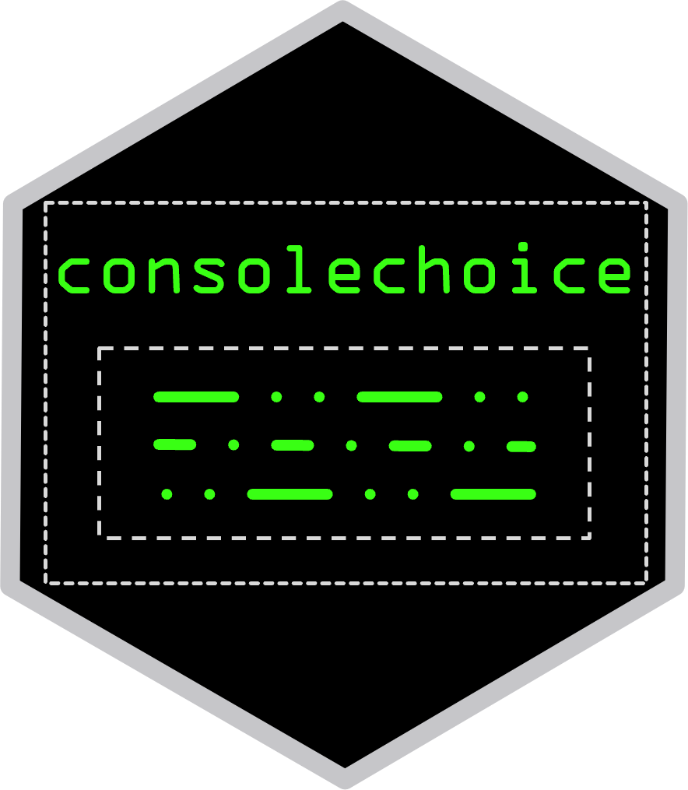

<!-- README.md is generated from README.Rmd. Please edit that file -->

# consolechoice </a>

<!-- badges: start -->

[](https://github.com/John-Piper/consolechoice/actions)
[](https://CRAN.R-project.org/package=consolechoice)
[](https://app.codecov.io/gh/John-Piper/consolechoice?branch=main)

<!-- badges: end -->

The goal of consolechoice is to make it easier to display a menu to the
console for the user to select an option. This will save time writing
code with loops and conditional logic. Only one line of code is required
using consolechoice to solve this issue.

consolechoice allows character vectors or folder paths as an argument to
print the menu to the console. Regular expression syntax can also be
used to limit certain file types or names for selection.

consolechoice helps take away the complexity of showing a menu in the
console and waiting for the users choice.

## Installation

You can install the development version of consolechoice from
[GitHub](https://github.com/) with:

``` r
# install.packages("devtools")
devtools::install_github("John-Piper/consolechoice")
```

## Usage

``` r
library(consolechoice)

# Example using console_menu function.

options <- c("Eat", "Sleep", "Code", "Repeat")


choice <- console_menu(options)

result <- switch(
  choice,
       "1" = "Eating some food",
       "2" = "Going to Sleep",
       "3" = "Doing some coding",
       "4" = options,
       "q" = stop("You have decided to quit")
)
       
print(result)


# Example using console_file_menu function.

choice <- console_file_menu(
  folder_path ="example/foler/address",
  pattern = ".txt"
  )

if (choice == "example.txt") {
  
  # code here...
  
} else {
  
  # more code here...
  
}
```
